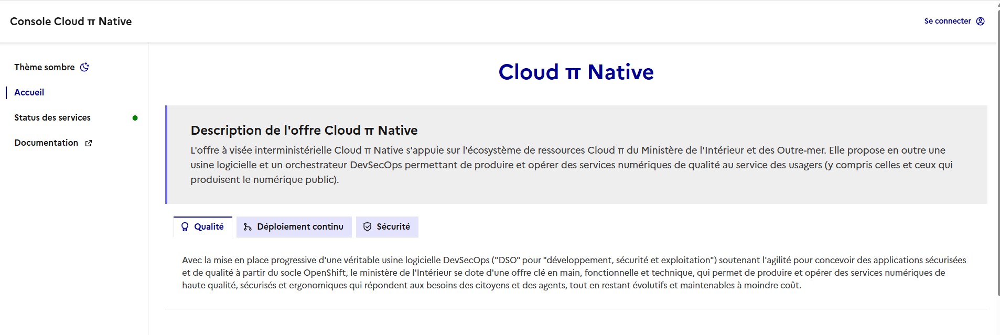
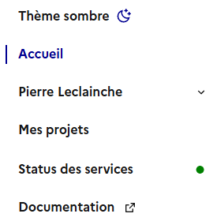
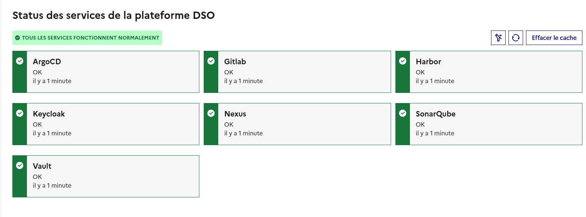
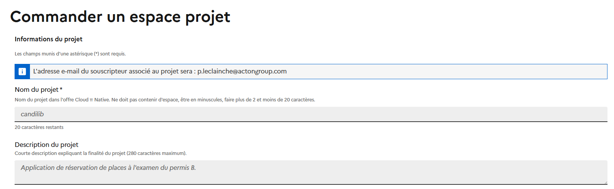
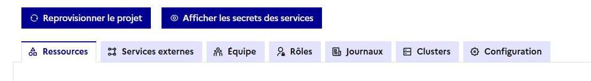
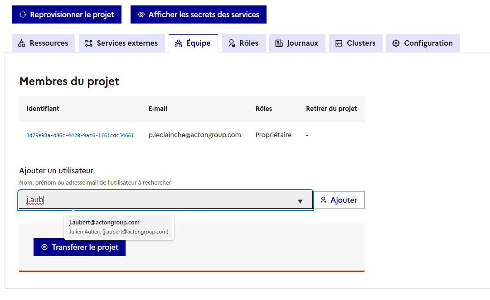
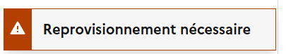
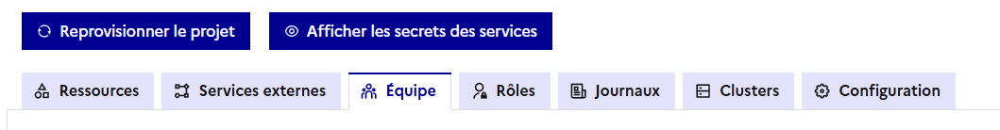
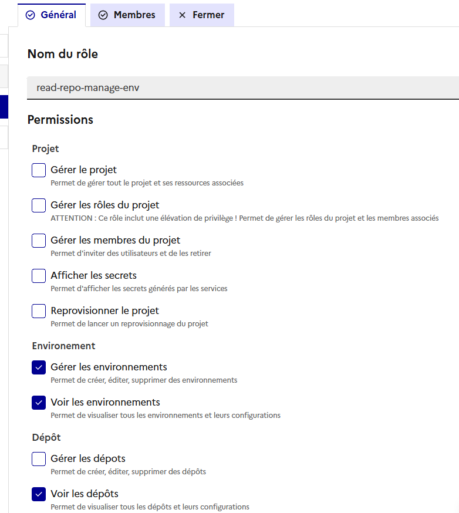
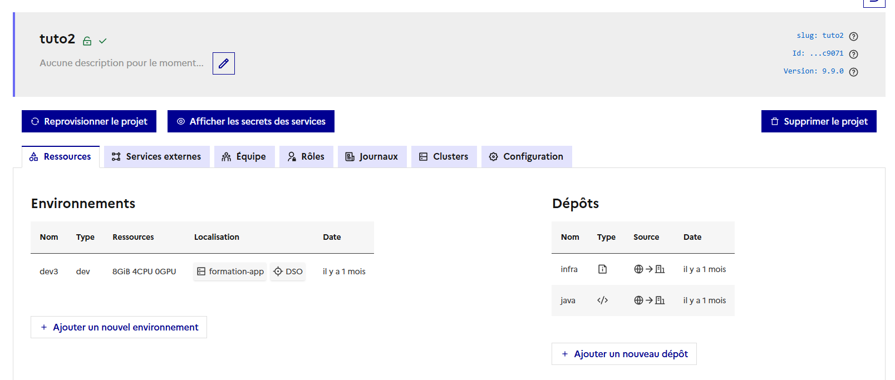

# Gestion des projets Cloud Pi Native

Vous en êtes à l'étape 1 de la formation CPiN :
1. ➡️ [Gestion des projets CPiN](https://github.com/cloud-pi-native/formation-cpin-gestion-projet)
2. [Application d'exemple pour déploiement sur CPiN](https://github.com/cloud-pi-native/formation-cpin-repo-applicatif)
3. [Gestion des artefacts sur CPiN](https://github.com/cloud-pi-native/formation-cpin-harbor-trivy)
4. [Chart Helm de démonstration sur CPiN](https://github.com/cloud-pi-native/formation-cpin-deploiement)
5. [Gestion des secrets sur CPIN](https://github.com/cloud-pi-native/formation-cpin-gestion-secret)
6. [Observabilité sur CPiN](https://github.com/cloud-pi-native/formation-cpin-observabilite)

## Connexion à CPiN

▶️ Ouvrez la console sur l'URL de [formation](https://console.dso.formation.numerique-interieur.fr/) 

▶️ En haut à droite, cliquez sur `Se connecter` et saisissez vos identifiants.

Une fois connecté le menu gauche suivant apparait :

Le menu permet :
 - D'accéder à ses informations de profil en cliquant sur son nom
 - D'accéder à ses projets CPiN
 - De voir le status des services CPiN de l'environnement
 - D'accéder à la documentation publique.

Le status des services affiche une page du type météo des services :

 

## Création d'un projet

▶️ Depuis le menu `Mes projets`, cliquez sur `+ Créer un nouveau projet`.

 

▶️ Créez un projet avec les paramètres suivants :
- `Nom du projet` : votre nom ou première lettre du prenom et 3 premières lettres du nom de famille (pdup pour Pierre 
Dupont)
- `Description` : Formation CPiN
- `Ressources Prod` et `Hors Prod du projet` :
  - 4 CPU
  - 8 Go de RAM
  - 0 GPU

▶️ Pour valider la création, cliquez sur le bouton `Commander mon espace projet`.

> [!IMPORTANT]
> Lors d'un déploiement réel sur l'offre CPiN au MI, ces informations doivent correspondre à la demande d'hébergement 
> que vous aurez faite, et correspondent aux quotas globaux de ressources de votre projet sur les clusters (*prod* et 
> *hors prod*)

Une fois le projet créé (environ 1 minute), le menu suivant apparait. Il permet de gérer les différents éléments d'un 
projet :

 - **Ressources** : Permet de gérer les environnements et les dépots de code source.
 - **Services externes** : permet d'accéder à son espace projet sur les différents outils de CPiN : ArgoCD, Gitlab, Grafana,
Harbor, etc.
 - **Équipe** : permet de gérer l'équipe qui peut accéder au projet.
 - **Rôles** : permet de définir des rôles aux membres de l'équipe projet.
 - **Journaux** : permet de voir les logs de la console sur les opérations de son projet.
 - **Clusters** : informations sur les clusters disponibles, le DNS et les secrets.
 - **Configuration** : permet d'accéder aux informations de ressources CPU/RAM/GPU du projet.

 ## Gestion d'équipe

▶️ Allez dans le menu `Équipe` puis ajoutez une personne via son email (travaillez par binôme, demandez à votre voisin 
de table).

Le bouton transférer le projet en fin de page permet de changer le propriétaire du projet et lui transférer tous les 
droits.

La modification des membres d'un projet nécessite de reprovisionner le projet. Un message s'affiche pour l'indiquer :

▶️ Cliquez sur le bouton `Reprovionner le projet`

Le reprovisonnement permet à la console de ré-appliquer l'ensemble des configurations de votre projet sur la console et 
les outils tiers (Gitlab, ArgoCD, etc.). Ces opérations sont idempotentes et peuvent donc être rejouées sans impact.

> [!TIP]
> À noter que la console déclenche cette action périodiquement de manière automatique.

## Gestion des rôles

▶️ Allez sur le menu `Rôle` du projet et créez un rôle `read-repo-manage-env` attribuant uniquement les droits suivants :
- *Voir les environnements*
- *Gérer les environnements*
- *Voir les dépôts*

▶️ Dans l'onglet `Membres`, ajoutez l'utilisateur' que vous avez ajouté à l'étape précédente.

▶️ Une fois que c'est fait par les 2 voisins, retournez dans la liste de vos projets et consultez le projet de votre voisin.
Vérifiez que vous avez bien les droits correspondants.

## Gestion des ressources

L'onglet `Ressources` permet de gérer :
 - les `Environnements` : permet de créer un environnement applicatif, associé à un cluster et un quota d'utilisation de ressources. 
 - les `Dépôts` : les dépôts de code correspondent à des dépôts git externe à CPiN et contenant : 
   - Soit du code applicatif dont le but est de construire et déposer une image Docker sur le dépôt d'artefact *Harbor*
   - Soit du code d'infrastructure contenant des manifest et des charts Helm ou Kustomize, permettant de déployer des applications.

Cette partie sera détaillée dans la suite de la formation.

Bravo, vous avez terminé le premier chapitre de la formation CPiN.